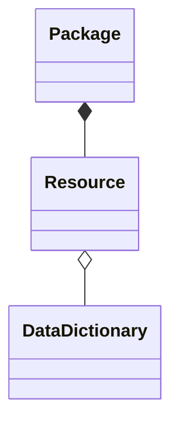

# Frictionless CKAN Mapper

A library for mapping CKAN metadata <=> Frictionless metadata.

The library has zero dependencies (not even on Data Package libs). You can use it directly or use it for inspiration. Detailed outline of the algorithm is in the docs or you can read the code.

[](https://travis-ci.org/frictionlessdata/frictionless-ckan-mapper)
[](https://coveralls.io/r/frictionlessdata/frictionless-ckan-mapper?branch=master)
[](https://pypi.python.org/pypi/frictionless-ckan-mapper)
[](http://semver.org/)
[](https://discord.gg/2UgfM2k)

<!-- toc -->
- [Install](#install)
- [Getting started](#getting-started)
- [Reference](#reference)
  * [CKANToFrictionless](#ckantofrictionless)
    + [`resource()`](#resource)
    + [`package()`](#package)
  * [FrictionlessToCKAN](#frictionlesstockan)
    + [`package()`](#package-1)
    + [`resource()](#resource)
- [Design](#design)
  * [CKAN reference](#ckan-reference)
  * [Algorithm: CKAN => Frictionless](#algorithm-ckan--frictionless)
  * [Algorithm: Frictionless => CKAN](#algorithm-frictionless--ckan)
- [Developers](#developers)
  * [Install source](#install-source)
  * [Tests](#tests)
<!-- tocstop -->

## Install

* Python: install Python. The library is compatible with both Python 2.7+ and Python 3.3+.
* `pip install frictionless_ckan_mapper`

## Getting started

```python
import frictionless_ckan_mapper

# or load from an API e.g.
# json.load(urllib.urlopen(https://demo.ckan.org/api/3/package_show?id=my_dataset)
ckan_dict = {
  "name": "my-dataset"
  "title": "My awesome dataset"
}

converter = frictionless_ckan_mapper.CKANToFrictionless()
out = converter.package(ckan_dict)

print(out)
```

## Reference

### CKANToFrictionless

#### `resource()`

#### `package()`

### FrictionlessToCKAN

#### `package()`

#### `resource()


## Design

```
Frictionless   <=>        CKAN
--------------------------------------
Data Package   <=>   Package (Dataset)
Data Resource  <=>   Resource
Table Schema   <=>   Data Dictionary?? (datastore resources can have schemas)
```

### CKAN reference

**Summary**:

* Class diagram below of key objects (without attributes)
* Objects with their attributes in this spreadsheet: https://docs.google.com/spreadsheets/d/1XdqGTFni5Jfs8AMbcbfsP7m11h9mOHS0eDtUZtqGVSg/edit#gid=1925460244




Source for CKAN metadata structure:

* Dataset (Package): https://docs.ckan.org/en/2.8/api/index.html#ckan.logic.action.create.package_create
* Resource: https://docs.ckan.org/en/2.8/api/index.html#ckan.logic.action.create.resource_create

### Algorithm: CKAN => Frictionless

For Package *and* Resource

1. Expand extras into the dict
2. Map those attributes we have known mappings for (and parse items with values e.g. a schema will be un-jsonified)
3. Drop anything we explicitly drop e.g. `package_id` on a resource object
4. Copy everything else over as is

Optional extras:

* Add a profile field

### Algorithm: Frictionless => CKAN

## Developers

### Install source

* clone the repo: `git clone https://github.com/frictionlessdata/ckan-datapackage-tools.git`
* and install it with pip: `pip install -e .`

### Tests

Use `pytest`:

```
pytest tests
```
