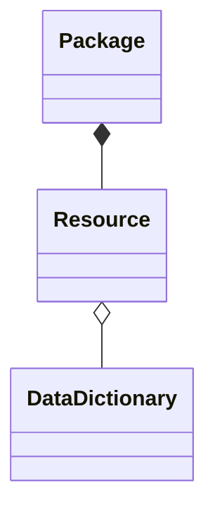

# Frictionless CKAN Mapper

A library for mapping CKAN metadata <=> Frictionless metadata.

The library has zero dependencies (not even on Data Package libs). You can use it directly or use it for inspiration. Detailed outline of the algorithm is in the docs or you can read the code.

[](https://travis-ci.org/frictionlessdata/frictionless-ckan-mapper)
[](https://coveralls.io/r/frictionlessdata/frictionless-ckan-mapper?branch=master)
[](https://pypi.python.org/pypi/frictionless-ckan-mapper)
[](http://semver.org/)
[](https://discord.gg/2UgfM2k)

<!-- toc -->

- [Frictionless CKAN Mapper](#frictionless-ckan-mapper)
  - [Installation](#installation)
  - [Getting started](#getting-started)
    - [CKAN => Frictionless](#ckan--frictionless)
    - [Frictionless => CKAN](#frictionless--ckan)
  - [Reference](#reference)
    - [`ckan_to_frictionless`](#ckan_to_frictionless)
      - [`resource(ckandict)`](#resourceckandict)
      - [`dataset(ckandict)`](#datasetckandict)
    - [`frictionless_to_ckan`](#frictionless_to_ckan)
      - [`resource(fddict)`](#resourcefddict)
      - [`package(fddict)`](#packagefddict)
  - [Design](#design)
    - [CKAN reference](#ckan-reference)
    - [Algorithm: CKAN => Frictionless](#algorithm-ckan--frictionless)
    - [Algorithm: Frictionless => CKAN](#algorithm-frictionless--ckan)
  - [Developers](#developers)
    - [Install the source](#install-the-source)
    - [Run the tests](#run-the-tests)
    - [Building and publishing the package](#building-and-publishing-the-package)
      - [Build the distribution package locally for testing purposes](#build-the-distribution-package-locally-for-testing-purposes)
      - [Test the package at test.pypi.org](#test-the-package-at-testpypiorg)
      - [Tag a new Git release and publish to the official PyPi](#tag-a-new-git-release-and-publish-to-the-official-pypi)
    <!-- tocstop -->

## Installation

- Python: install Python. The library is compatible with both Python 2.7+ and Python 3.3+.

```bash
pip install frictionless-ckan-mapper
```

**Note:** The package is installed as `frictionless-ckan-mapper` and then imported as `frictionless_ckan_mapper`.

## Getting started

### CKAN => Frictionless

```python
# get a CKAN metadata item
ckan_dataset = {
  "name": "my-dataset",
  "title": "My awesome dataset",
  "url": "http://www.example.com/data.csv"
}

# or load from an API e.g.
# ckan_dataset = json.load(urllib.urlopen(
#     https://demo.ckan.org/api/3/package_show?id=my_dataset
# ))

from frictionless_ckan_mapper import ckan_to_frictionless as converter

# convert to frictionless
frictionless_package = converter.dataset(ckan_dict)

print(frictionless_package)
```

### Frictionless => CKAN

```python
frictionless = {
  'name': "f11s-dataset",
  'path': "https://datahub.io/data.csv"
}

from frictionless_ckan_mapper import frictionless_to_ckan as f2c

ckanout = f2c.dataset(frictionless)

print(ckanout)
```

## Reference

This package contains two modules:

- `frictionless_to_ckan`
- `ckan_to_frictionless`

You can import them directly like so:

```python
from frictionless_ckan_mapper import ckan_to_frictionless
from frictionless_ckan_mapper import frictionless_to_ckan
```

### `ckan_to_frictionless`

#### `resource(ckandict)`

```python
from frictionless_ckan_mapper import ckan_to_frictionless as converter

# ... Some code with a CKAN dictionary ...

output_frictionless_dict = converter.resource(ckan_dictionary)
```

#### `dataset(ckandict)`

```python
from frictionless_ckan_mapper import ckan_to_frictionless as converter

# ... Some code with a CKAN dictionary ...

output_frictionless_dict = converter.dataset(ckan_dictionary)
```

### `frictionless_to_ckan`

#### `resource(fddict)`

```python
from frictionless_ckan_mapper import frictionless_to_ckan as converter

# ... Some code with a Frictionless dictionary ...

output_ckan_dict = converter.resource(frictionless_dictionary)
```

#### `package(fddict)`

```python
from frictionless_ckan_mapper import frictionless_to_ckan as converter

# ... Some code with a Frictionless dictionary ...

output_ckan_dict = converter.package(frictionless_dictionary)
```

## Design

```text
Frictionless   <=>        CKAN
--------------------------------------
Data Package   <=>   Package (Dataset)
Data Resource  <=>   Resource
Table Schema   <=>   Data Dictionary?? (datastore resources can have schemas)
```

### CKAN reference

**Summary:**

- Class diagram below of key objects (without attributes)
- Objects with their attributes in this spreadsheet: https://docs.google.com/spreadsheets/d/1XdqGTFni5Jfs8AMbcbfsP7m11h9mOHS0eDtUZtqGVSg/edit#gid=1925460244




Source for CKAN metadata structure:

- Dataset (Package): https://docs.ckan.org/en/2.8/api/index.html#ckan.logic.action.create.package_create
  - `Package.as_dict` method: https://github.com/ckan/ckan/blob/2.8/ckan/model/package.py#L195-L223
  - `package_show` ...

* Resource: https://docs.ckan.org/en/2.8/api/index.html#ckan.logic.action.create.resource_create

### Algorithm: CKAN => Frictionless

See the code in [`frictionless_ckan_mapper/ckan_to_frictionless.py`](./frictionless_ckan_mapper/ckan_to_frictionless.py)

### Algorithm: Frictionless => CKAN

See the code in [`frictionless_ckan_mapper/frictionless_to_ckan.py`](./frictionless_ckan_mapper/frictionless_to_ckan.py)

## Developers

### Install the source

- Clone the repo:

  ```bash
  git clone https://github.com/frictionlessdata/frictionless-ckan-mapper.git
  ```

- And install it with pip:

  ```bash
  pip install -e .
  ```

### Run the tests

Use the excellent `pytest` suite as follows:

```bash
pytest tests
```

To test under both Python 2 and Python 3 environments, we use `tox`. You can run the following command:

```bash
make test
```

**Note:** Make sure that the necessary Python versions are in your environment `PATH` (Python 2.7 and Python 3.6).

### Building and publishing the package

To see a list of available commands from the `Makefile`, execute:

```bash
make list
```

#### Build the distribution package locally for testing purposes

If a previous build exists, make sure to also remove it before building again:

```bash
make distclean
```

Then:

```bash
make dist
```

Alternatively, this command will accomplish the same to build packages for both Python 2 and Python 3:

```bash
python setup.py sdist bdist_wheel --universal
```

#### Test the package at test.pypi.org

```bash
python -m twine upload --repository testpypi dist/*
```

The package will be publicly available at https://test.pypi.org/project/frictionless-ckan-mapper/ and you will be able to `pip install` it as usual.

#### Tag a new Git release and publish to the official PyPi

Make sure to update the version of the package in the file `frictionless_ckan_mapper/VERSION`. Then:

```bash
make release
```

You can quickly review the version to release with `make version`, which will print the current version stored in `VERSION`.
